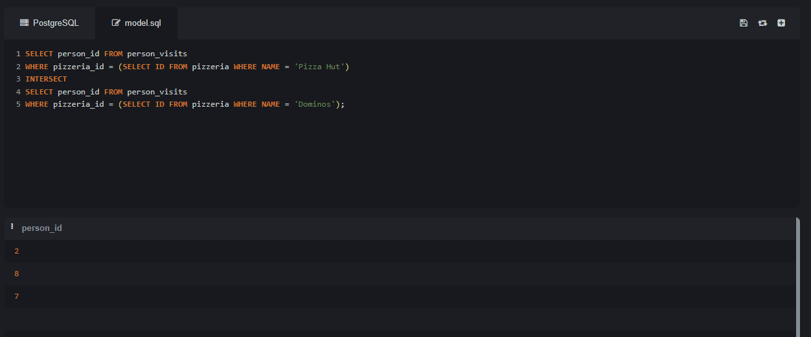
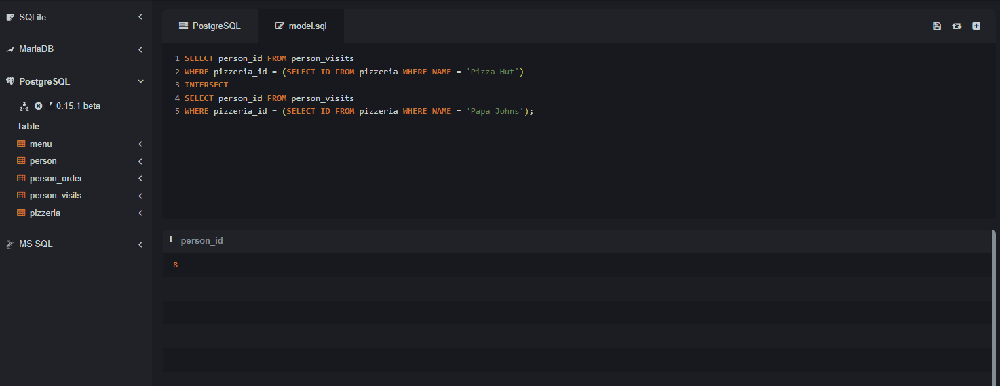
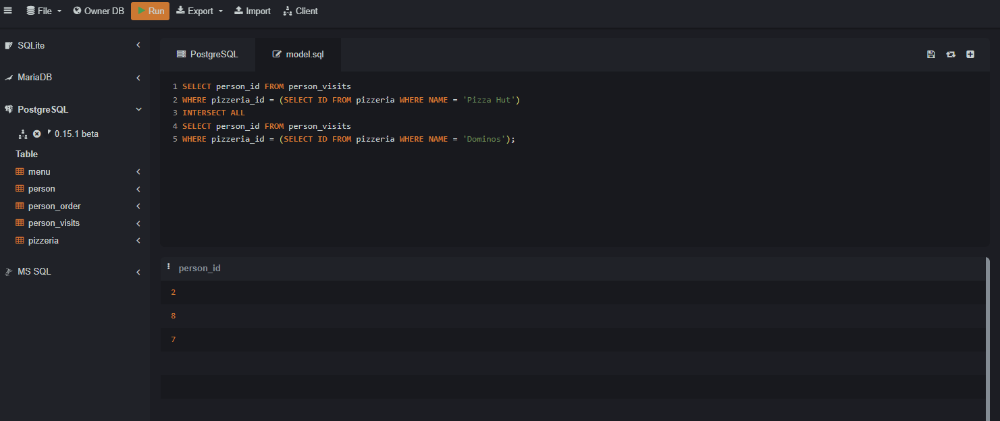
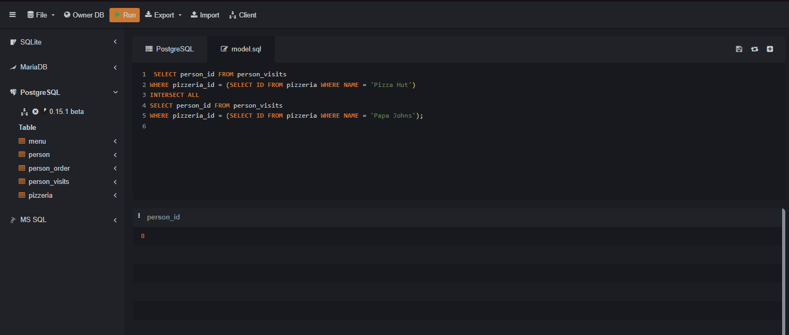
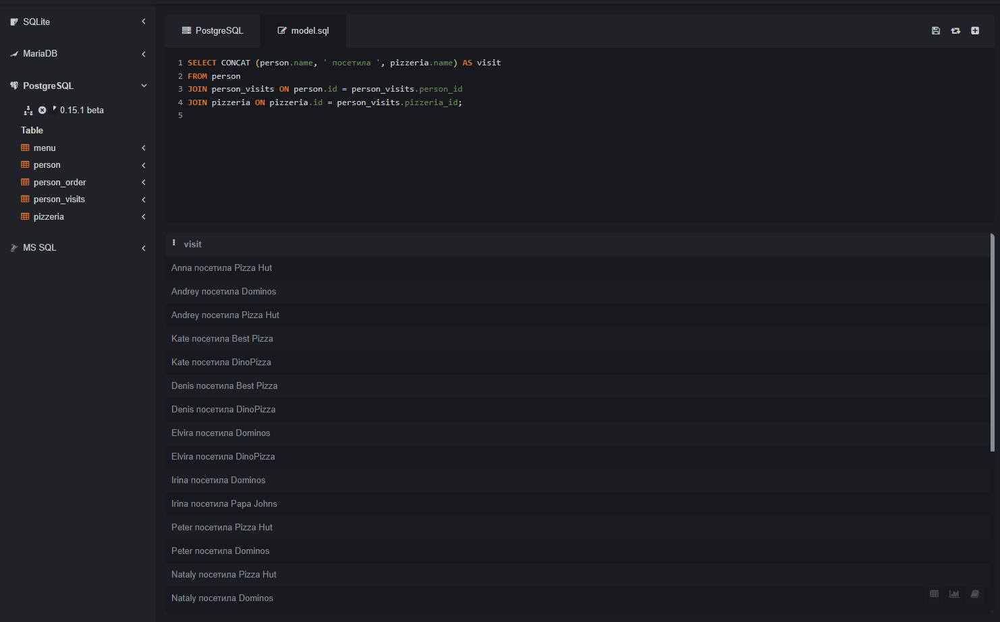
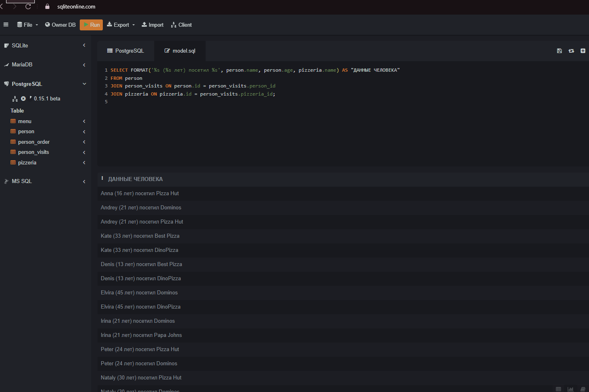
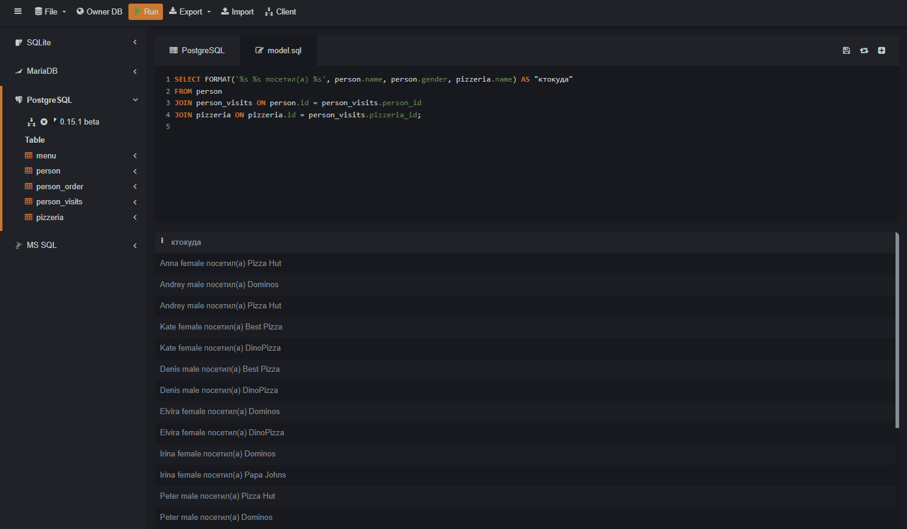

## 1. ИНТЕРСЕКТ

### Возвращает уникальные записи, которые присутствуют в обоих наборах результатов.

## Пример:
Найти людей, которые посетили `Pizza Hut` и `Dominos`.





---

Найти людей, которые посетили `Pizza Hut` и `Papa Johns`.




---

## 2. ИНТЕРСЕКТ АЛЛ

### Возвращает все записи, включая дубликаты, которые присутствуют в обоих наборах результатов.

## Пример:
Найти все случаи, когда один и тот же человек посетил `Pizza Hut` и `Dominos` (включая многократные визиты в один день).




---

## Пример:
Найти все случаи, когда один и тот же человек посетил `Pizza Hut` и `Papa Johns` (включая многократные визиты в один день).




---

## 3. КОНКАТ

### Объединяет строки, чтобы создать одну строку из двух или более строк.

## Пример:
Создать список людей с их именами и пиццерией, которую они посетили, объединенными в одну строку.



---

## Пример:
Создать список пиццерий с их названием и рейтингом, объединенными в одну строку.


---

## 4. ФОРМАТ

### Форматирует строки с использованием указанных значений, вставляя их в определенные позиции в строке.

## Пример:
Сгенерировать форматированную строку, показывающую имя человека, его возраст и название пиццерии, которую он посетил.



---

## Пример:
Сгенерировать форматированную строку, показывающую имя человека, его пол и название пиццерии, которую он посетил.




1. ИНТЕРСЕКТ
```sql
SELECT person_id FROM person_visits
WHERE pizzeria_id = (SELECT id FROM pizzeria WHERE name = 'Pizza Hut')
INTERSECT
SELECT person_id FROM person_visits
WHERE pizzeria_id = (SELECT id FROM pizzeria WHERE name = 'Dominos'); 
```
```sql
SELECT person_id FROM person_visits
WHERE pizzeria_id = (SELECT id FROM pizzeria WHERE name = 'Pizza Hut')
INTERSECT
SELECT person_id FROM person_visits
WHERE pizzeria_id = (SELECT id FROM pizzeria WHERE name = 'Papa Johns'); 
```
2. ИНТЕРСЕКТ АЛЛ
```sql
SELECT person_id FROM person_visits
WHERE pizzeria_id = (SELECT id FROM pizzeria WHERE name = 'Pizza Hut')
INTERSECT ALL
SELECT person_id FROM person_visits
WHERE pizzeria_id = (SELECT id FROM pizzeria WHERE name = 'Dominos'); 
``` 
```sql
SELECT person_id FROM person_visits
WHERE pizzeria_id = (SELECT id FROM pizzeria WHERE name = 'Pizza Hut')
INTERSECT ALL
SELECT person_id FROM person_visits
WHERE pizzeria_id = (SELECT id FROM pizzeria WHERE name = 'Papa Johns');
```

3. КОНКАТ
```sql
SELECT CONCAT (person.name, ' посетила ', pizzeria.name) AS visit
FROM person
JOIN person_visits ON person.id = person_visits.person_id
JOIN pizzeria ON pizzeria.id = person_visits.pizzeria_id;
```
```sql
SELECT CONCAT(name, ' имеет рейтинг ', rating) AS pizzeria_details
FROM pizzeria; 
```
4. ФОРМАТ
```sql
SELECT FORMAT('Person %s (age %s) visited %s', person.name, person.age, pizzeria.name) AS "ДАННЫЕ ЧЕЛОВЕКА"
FROM person
JOIN person_visits ON person.id = person_visits.person_id
JOIN pizzeria ON pizzeria.id = person_visits.pizzeria_id;
```
```sql
SELECT FORMAT('%s %s посетил(а) %s', person.name, person.gender, pizzeria.name) AS "ктокуда"
FROM person
JOIN person_visits ON person.id = person_visits.person_id
JOIN pizzeria ON pizzeria.id = person_visits.pizzeria_id;
```
